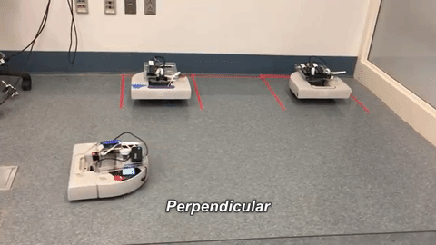
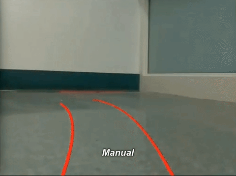

# AutonomousParking
Computational Introduction to Robotics Final Project: Neato autonomous parking

Authors: [@kimasenbeck](https://github.com/kimasenbeck), [@jovanduy](https://github.com/jovanduy), [@ziyilan](https://github.com/Ziyilan)

We have created a full parking assist system for the Neato. This system allows the user to choose from a number of different parking modes: autonomous parallel parking, autonomous perpendicular parking, or a manual parking mode with visual parking guidelines. This suite of features is modeled after the parking assist features found in modern cars. Our implementation is inspired by the state-of-the-art algorithms which underlie parallel parking mechanisms. For more information and demos, check out our [project website](https://ziyilan.github.io/)!

## Implementation
### Autonomous Parking
Our autonomous parking program is modeled after the algorithms used in industry level (semi-)autonomous vehicles. Perpendicular and parallel parking are very similar; the only difference is that the parallel parking path follows two smaller angled circular arcs while the perpendicular path consists of one 90˚ arc.  The logical flow throughout the program is as follows:
1. Drive alongside the parking spots.
2. Lidar callback function collects data
  - Distance to wall
  - Distance to parked Neato (to make sure you’re far enough away to park)
  - Distance between the two parked cars - gives us width of our spot
3. Determine radius, origin
  - Radius = 0.5 * (distance to wall)
  - Origin = (middle of parking spot + radius, radius)
4. Drive forward radius from middle of parking spot
5. Begin driving arc one (90 degrees)
6. If we’re in parallel mode, drive arc two.
7. In both modes, finish by making any necessary alignment adjustments.

### Manual Parking
Manual parking assist mode works by subscribing to the Twists of the Neato and projecting the Neato's expected path, based on the current velocity, onto the image. The process works as the following:

#### Create a top-down image of projected path
We did this with OpenCV’s ellipse drawing function. We began by drawing one arc which represented the path that the Neato would travel. Since we wanted to show the projected path of the Neato’s “tire tracks” as cars typically do, we duplicated this arc and shifted it a fixed distance left and right of the center point in the x direction to represent the paths of the left and right wheels.
	The arc we drew is roughly a quarter of an ellipse. The radius of our arc is equal to velocity/omega. The center of the arc is a function of the radius, as are the axes. We adjusted directionality appropriately based on omega. This is done by manipulating the start and end angles of the arc.
	At this point, we’ve drawn an ellipse that corresponds with the Neato’s projected path. When we change the velocity and omega of the Neato using teleop twist, we can see that the path responds appropriately and as expected. One problem remains, though, which is that the path we’ve got at this point is a top-down representation of the Neato’s projected arc.

#### Warping/Transforming the Arc
In this step, we took the top-down arcs image we drew in the previous step and warp it to fit the plane of the ground on the Neato’s camera footage. To do so, we made use of OpenCV’s built in `getPerspectiveTransform` and `warpPerspective` functions.

#### Overlaying the Arc
Our warped arc is drawn on a transparent background. Once we have our warped image, we overlay this image on top of the Neato’s camera footage. This process involves performing bitwise operations on the image to create masks, extract any areas with color, and then lay the extracted areas onto the “region of interest” we define on our original camera footage. As stated above, the region of interest is the plane that corresponds with the ground in our camera footage.

#### Checking for Alignment
In our CV project, we developed an HSV filter for the Neato’s camera footage that filtered out parking spot delineators into a binary image.

Using this binary image, we applied OpenCV’s Probabilistic Hough Line Transform Algorithm to detect the lines in the image. This allowed us to determine the endpoints of each of our parking spots.

As our final step, we compared the endpoints of our projected path to the endpoints of the parking spot we detected using the steps above. As long as the pixel coordinates of the projected path’s endpoints fell within the pixel coordinates of the actual parking spot’s endpoints, the Neato is aligned. When the Neato is aligned, we change the color of the Neato’s parking guidelines to green to indicate we are ready to move forward into the spot and park.

## Dependencies and installation
- ROS: visit [this link](http://wiki.ros.org/kinetic/Installation/Ubuntu) for installation details
- OpenCV: `pip install opencv`
- Numpy: `pip install numpy`

## Usage
First, run `roscore` and connect to a Neato.

- Perpendicular parking: `rosrun auto_parking parking.py`
- Parallel parking: `rosrun auto_parking parking.py _parallel:=False`
- For manual parking assist, run `rosrun teleop_twist teleop_twist` to enter into teleop twist mode to access control over the Neato. To open the assist, run `rosrun auto_parking manual_parking.py`

## References
- Path Planning and Steering Control for an Automatic Perpendicular Parking Assist System; Plamen Petrov, Fawzi Nashashibi, Member, IEEE, and Mohamed Marouf
http://ppniv15.irccyn.ec-nantes.fr/material/session3/Petrov/paper.pdf
- Autonomous Parallel Parking of a Nonholonomic Vehicle; Lisa Sullivan, Christopher Wiens, Mun Hoe Sze Tho, Trenton Palm, and Joel A. Hesch
http://www-users.cs.umn.edu/~joel/_files/Joel_Hesch_EE4951.pdf
